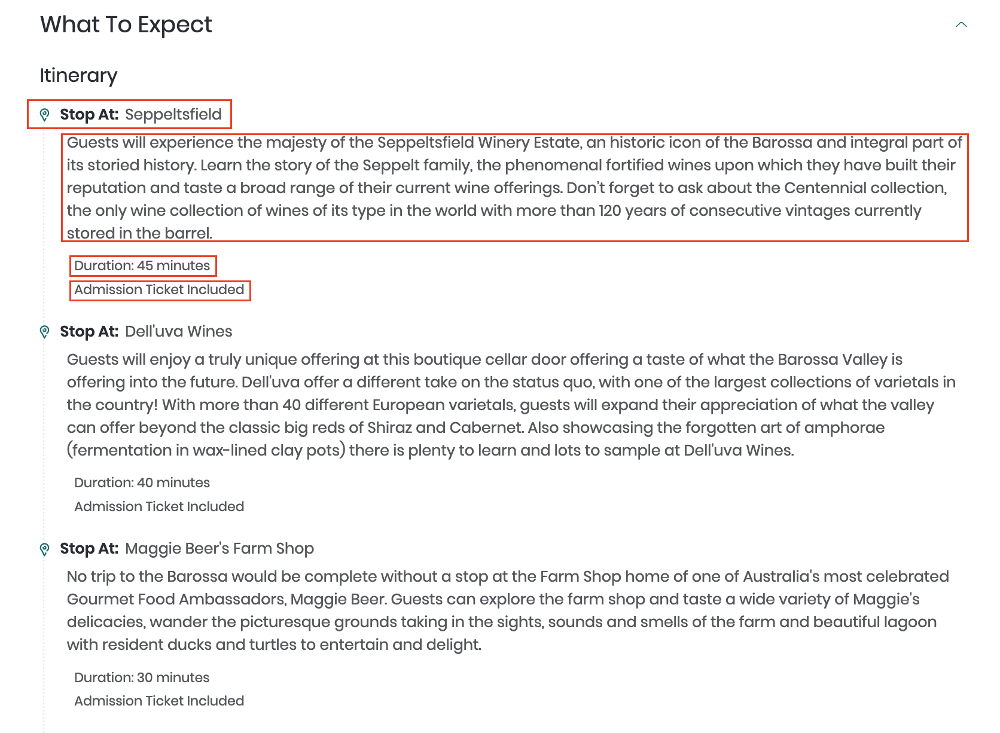
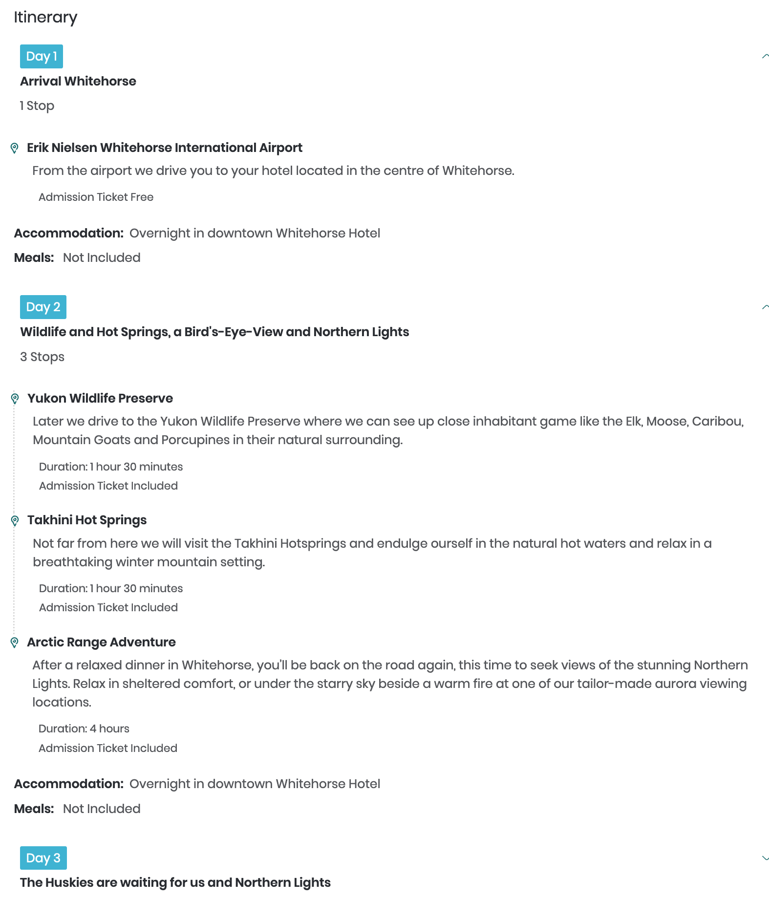
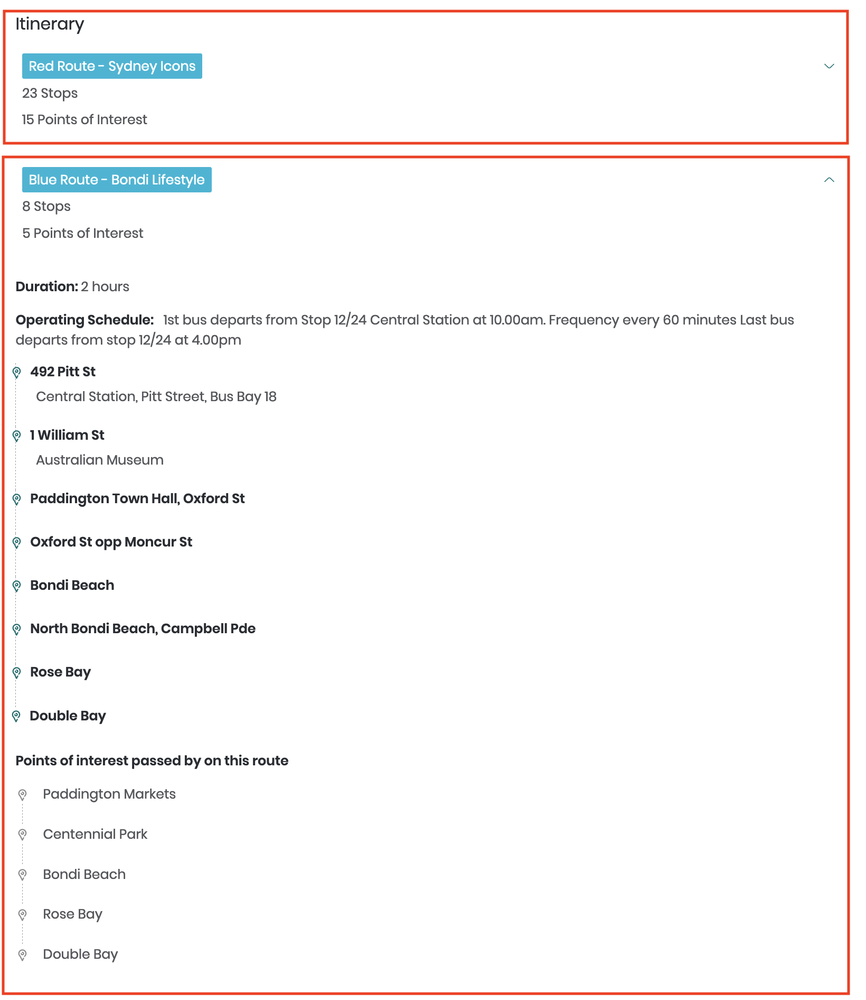

# Itineraries

The itinerary for a product is used to communicate to customers what to expect with regard to where they will go when participating in the tour or activity. On the [Viator.com website](https://viator.com), this information is displayed in the **What to expect** section on each product's product display page.

Itinerary information is available from this API in a machine-interpretable, structured format that facilitates graphical display and advanced search, should you choose to implement it.

The itinerary information for each product is contained in the `itinerary` object in the response from any of the [product content endpoints](../content-ingestion-endpoints/#product-content-endpoints).

There are five types of itinerary, and the type is specified in the `itinerary.itineraryType` field. They are as follows:

| Itinerary type | `itineraryType` | Meaning |
|----------------|-----------------------|---------|
| <a href="#standard-itinerary">**Standard**</a> | `"STANDARD"` | A tour-based product (focused on visiting and viewing) that occurs at a single location or proceeds through a set of locations on a single day.  |
| <a href="#activity-itinerary">**Activity**</a> | `"ACTIVITY"` | An activity-based product (focused on the activity rather than the location) that occurs at a single location or proceeds through a set of locations on a single day |
| <a href="#multi-day-tour-itinerary">**Multi-day tour**</a> | `"MULTI_DAY_TOUR"` | A tour or activity that occurs over multiple days, and therefore includes food and accommodation |
| <a href="#hop-on--hop-off-itinerary">**Hop-on / hop-off**</a> | `"HOP_ON_HOP_OFF"` | A tour that operates continuously, such as a bus tour, wherein passengers can use their ticket to board and alight as they please at any of the stops along the route |
| <a href="#unstructured-itinerary">**Unstructured**</a> | `"UNSTRUCTURED"` | Not all suppliers have upgraded the itinerary information for their products from a text-based description to structured data; therefore, the itinerary information for a small number of products remains unparseable for the time being. | 

## Common elements

The `itinerary` object is polymorphic depending on the `itineraryType`, but all variants contain standard information, as follows:

| Field name | Meaning |
|------------|---------|
| `skipTheLine` | `true` if a ticket for this product allows participants to attend a location without having to obtain a separate ticket on the occasion itself |
| `privateTour` | `true` if only the travelers who have booked this product will be present; `false` if it is a shared tour |
| `maxTravelersInSharedTour` | If `privateTour` is `false`, this value represents the maximum number of people that will be able to participate in the tour or activity. |
| `unstructuredDescription` | In the event that structured information is not available, this field will contain a plain-text description of the itinerary. |

All other elements in the `itinerary` object differ slightly according to the value of `itineraryType`.

## Standard itinerary

Products with a `"STANDARD"` itinerary type are tour-based products (focused on visiting and viewing) that occur at a single location or proceed through a set of locations on a single day.

An example of a `"STANDARD"` itinerary product is [Barossa Valley Highlights from Barossa Valley Including Wine and Cheese Tasting (21381P1)](https://www.viator.com/tours/Barossa-Valley/Barossa-Valley-Highlights-from-Adelaide-or-Barossa-Valley-Including-Wine-and-Cheese-Tasting/d5623-21381P1).

The `itinerary` object in the product-content response for this tour is as follows (truncated to the first three items for brevity):

```javascript
"itinerary": {
  "itineraryType": "STANDARD",
  "skipTheLine": false,
  "duration": {
    "fixedDurationInMinutes": 360
  },
  "itineraryItems": [
    {
      "pointOfInterestLocation": {
        "location": {
          "ref": "LOC-5620ab70-c813-4904-ad13-bcf527540d3e"
        },
        "attractionId": 17873
      },
      "duration": {
        "fixedDurationInMinutes": 45
      },
      "passByWithoutStopping": false,
      "admissionIncluded": "YES",
      "description": "Guests will experience the majesty of (...) "
    },
    {
      "pointOfInterestLocation": {
        "location": {
          "ref": "LOC-7ae41705-fd91-4500-8cde-bbe9b3a00df4"
        }
      },
      "duration": {
        "fixedDurationInMinutes": 40
      },
      "passByWithoutStopping": false,
      "admissionIncluded": "YES",
      "description": "Guests will enjoy a truly unique offering (...)"
    },
    {
      "pointOfInterestLocation": {
        "location": {
          "ref": "LOC-9494c4cf-f4e4-4e7f-8213-0cf1b9980097"
        }
      },
      "duration": {
        "fixedDurationInMinutes": 30
      },
      "passByWithoutStopping": false,
      "admissionIncluded": "YES",
      "description": "No trip to the Barossa would be complete without (...)"
    }
    (...)
  ]
}
```
The `itineraryItems[]` array describes the itinerary of locations for this tour and can be used in conjunction with the [/locations/bulk](../../../openapi/reference/operation/locationsBulk) endpoint to contruct a **What to expect** section, similar to what is seen for this product on [viator.com](https://www.viator.com/tours/Barossa-Valley/Barossa-Valley-Highlights-from-Adelaide-or-Barossa-Valley-Including-Wine-and-Cheese-Tasting/d5623-21381P1), as in the following screen-shot:

<figure>
    
    <figcaption>Standard itinerary example from viator.com</figcaption>
</figure>

The elements highlighted in red boxes are sourced as follows:

**"Stop At: Seppeltsfield"**

The name of each location (in the highlighted case, 'Seppeltsfield') is not included in the response and must be determined by submitting the location reference code in the `pointOfInterestLocation.location.ref` field to the [/locations/bulk](../../../openapi/reference/operation/locationsBulk) endpoint.

The location reference is `"LOC-5620ab70-c813-4904-ad13-bcf527540d3e"`:

```javascript
"pointOfInterestLocation": {
  "location": {
    "ref": "LOC-5620ab70-c813-4904-ad13-bcf527540d3e"
}
```

Submitting this code to the [/locations/bulk](../../../openapi/reference/operation/locationsBulk) endpoint yields the following response:

```javascript
{
  "locations": [
    {
      "provider": "TRIPADVISOR",
      "reference": "LOC-5620ab70-c813-4904-ad13-bcf527540d3e",
      "name": "Seppeltsfield",
      "address": {
        "street": "730 Seppeltsfield Rd",
        "administrativeArea": "Seppeltsfield",
        "state": "South Australia",
        "country": "Australia",
        "countryCode": "AU",
        "postcode": "5355"
      },
      "center": {
        "latitude": -34.489162,
        "longitude": 138.91866
      }
    }
  ]
}
```

The name of the location is in the `name` element; i.e., `"Seppeltsfield"`.

**Description**

The description for each itinerary stop is given in the `description` field; in this case:

```javascript
"description": "Guests will experience the majesty of the Seppeltsfield Winery Estate, an historic icon of the Barossa and integral part of its storied history. Learn the story of the Seppelt family, the phenomenal fortified wines upon which they have built their reputation and taste a broad range of their current wine offerings. Don’t forget to ask about the Centennial collection, the only wine collection of wines of its type in the world with more than 120 years of consecutive vintages currently stored in the barrel. "
```

**"Duration: 45 minutes"**

The duration spent at an itinerary location is given in the `duration` element. This can be a fixed duration, as in this example and indicated by the `fixedDurationInMinutes` field being filled; i.e.:

```javascript
"duration": {
  "fixedDurationInMinutes": 45
},
```

Or, the time spent at the location might be variable, in which case only the `variableDurationFromMinutes` and `variableDurationToMinutes` fields will appear; e.g.:

```javascript
"duration": {
  "variableDurationFromMinutes": 10,
  "variableDurationToMinutes": 30
},
```

**"Admission Ticket Included"**

This item of information indicates to the traveler whether or not they will be required to pay for admission to a location or whether admission is included in the price of the tour. It is indicated by the `admissionIncluded` field; which in this case is:

```javascript
  "admissionIncluded": "YES"
```
The possible values this field can take are:
- `"YES"`
- `"NO"`
- `"NOT_APPLICABLE"`

**Pass by without stopping**

In this example, the `passByWithoutStopping` element is `false` for all locations. On some tours, however, the vehicle will merely pass by a certain location, without stopping, for viewing purposes. If that is the case, this field will be `true`.

## Activity itinerary

The "activity" itinerary is designed for products where the focus of the experience is the activity itself (e.g., cooking classes), rather than the location(s) at which it occurs.

The `itinerary` object for this type of product includes the `activityInfo` and `foodMenus` objects, which contain details about the activity and any meals being served (or created), respectively.

**Example activity experience**: [Traditional Cooking Class - 114869P3](https://www.viator.com/tours/Yogyakarta/Traditional-Cooking-Class/d22560-114869P3)

```javascript
"itinerary": {
  "itineraryType": "ACTIVITY",
  "skipTheLine": false,
  "privateTour": true,
  "duration": {
    "fixedDurationInMinutes": 240
  },
  "pointsOfInterest": [
    {
       "ref": "LOC-o0AXGEKPN4wJ9sIG0RAn5C7cXoFi13Pb8aiiiEWiVprM1MtQdt/DIeeb7ErQo1SK"
    }
  ],
  "activityInfo": {
    "location": {
       "ref": "LOC-dwbUKYXwDvt911EeSQVjwo4itqM47D/JrJBMhEHXctp6Yj8SzOvLCGbeQQ0arbNw8FHTuTEi0SU9RbKNpLx7bw8HP6Pnh1pBwy27irN3vKoTexOgxSlj2+xv9x3k6fZnPrb/zhY5RImUibPpbTET/+atZD8crT0DlPf5hg21QPWNam1RsZKgzF5gb1fPZ6d7WNWIWYsu3m54y2TFqiHaAbo1d2Ps2LFK+DCctmyDmqbgSV7FDpLXv5sL/e0R/Mg+7vLX0lMV8HGW4jisRxqYD5oThATP9j1NRY98SvhXpEI="
    },
    "description": "Embark on a culinary adventure unlocking the secrets of authentic Javanese cooking, utilizing traditional ingredients and preparation methods.\nYour day starts early at the local markets, where you can pick from fresh herbs & spices, crisp vegetables and choice cuts of meat. \nAfter exploring at the traditional market, you will be warmly welcomed and expertly guided by your host, who will help you to discover how to create your very own delicious authentic Javanese dishes. \nYour hard work is rewarded when you sit down to have lunch on your tasty creations.\nAll classes are conducted in English by Javanese chefs fully conversant with Javanese cuisine and culture...and in a relaxed, friendly atmosphere in the beautiful kitchen-garden."
  },
  "foodMenus": [
    {
       "course": "MAIN",
       "dishName": "Gado-gado",
       "dishDescription": "Mixed vegetables with peanut sauce"
    },
    {
       "course": "MAIN",
       "dishName": "Opor Ayam",
       "dishDescription": "Braised Chicken in Coconut Milk"
    }
  ]
}
```

All information for the 'What to Expect' section on the product display page on Viator.com is can be sourced from this object.

## Multi-day tour itinerary

Products with a `"MULTI_DAY_TOUR"` itinerary type are tours or activities that occur over multiple days, and therefore include a breakdown of the itinerary for each day of the tour, as well as extra information about food and accommodation.

**Example multi-day tour**: [Active Winter Adventure in Yukon | 5 days (7110P7)](https://www.viator.com/tours/Whitehorse/5-Day-Active-Winter-Adventure-in-Yukon/d5420-7110P7)

Screenshot of 'What to expect' section from the viator.com site:

<figure>
    
    <figcaption>Multi-day tour itinerary example from viator.com</figcaption>
</figure>

Snippet of the `itinerary` object in the product content response for 7110P7 (truncated to first two items of `days[]` array):

```javascript
"itinerary": {
  "itineraryType": "MULTI_DAY_TOUR",
  "skipTheLine": false,
  "days": [
    {
      "title": "Arrival Whitehorse",
      "dayNumber": 1,
      "items": [
        {
          "pointOfInterestLocation": {
            "location": {
              "ref": "LOC-99b0f435-fa6a-469f-8f96-f983b82f74c5"
            }
          },
          "duration": {},
          "admissionIncluded": "NOT_APPLICABLE",
          "description": "From the airport we drive you to your hotel located in the centre of Whitehorse."
        }
      ],
      "accommodations": [
        {
          "description": "Overnight in downtown Whitehorse Hotel"
        }
      ]
    },
    {
      "title": "Wildlife and Hot Springs, a Bird's-Eye-View and Northern Lights",
      "dayNumber": 2,
      "items": [
        {
          "pointOfInterestLocation": {
            "location": {
              "ref": "LOC-799e6c90-d0bb-4ec4-9cf6-c40459ff0463"
            },
            "attractionId": 25942
          },
          "duration": {
            "fixedDurationInMinutes": 90
          },
          "admissionIncluded": "YES",
          "description": "Later we drive to the Yukon Wildlife Preserve where we can see up close inhabitant game like the Elk, Moose, Caribou, Mountain Goats and Porcupines in their natural surrounding."
        },
        {
          "pointOfInterestLocation": {
            "location": {
              "ref": "LOC-cf8d0f7a-54d6-4cc1-9911-480b4934c752"
            },
            "attractionId": 25951
          },
          "duration": {
            "fixedDurationInMinutes": 90
          },
          "admissionIncluded": "YES",
          "description": "Not far from here we will visit the Takhini Hotsprings and endulge ourself in the natural hot waters and relax in a breathtaking winter mountain setting."
        },
        {
          "pointOfInterestLocation": {
            "location": {
              "ref": "LOC-3251a39d-aa69-4229-9ba4-57d5b417e6db"
            }
          },
          "duration": {
            "fixedDurationInMinutes": 240
          },
          "admissionIncluded": "YES",
          "description": "After a relaxed dinner in Whitehorse, you’ll be back on the road again, this time to seek views of the stunning Northern Lights. Relax in sheltered comfort, or under the starry sky beside a warm fire at one of our tailor-made aurora viewing locations. "
        }
      ],
      "accommodations": [
        {
          "description": "Overnight in downtown Whitehorse Hotel"
        }
      ]
    },
    (...)
  ]
}
```

Within the `days[]` array, each day of the multi-day tour is described. The `items[]` array within each item of the `days[]` array largely follows the structure of the items in the `itineraryItems[]` array of the `"STANDARD"` itinerary and can be interpreted for display.

**Note**: The example above does not include the `foodAndDrinks[]` element, as it is not relevant to this product.

## Hop-on / hop off itinerary

A hop-on/hop-off product is one that typically operates continuously during its hours of operation, such as a bus tour, and passengers can use their ticket to board and alight as they please at any of the stops along the route.

Such products may also operate multiple routes simultaneously.

**Example hop-on / hop-off tour**:[Big Bus Sydney and Bondi Hop-on Hop-off Tour (5010SYDNEY)](https://www.viator.com/tours/Sydney/Sydney-and-Bondi-Hop-on-Hop-off-Tour/d357-5010SYDNEY)

<figure>
    
    <figcaption>Hop-on / hop-off itinerary example from viator.com</figcaption>
</figure>

Snippet of `itinerary` object in the product content response for 5010SYDNEY (`operatingSchedule`, `stops` and `pointsOfInterest` truncated in first route):

```javascript
"itinerary": {
  "itineraryType": "HOP_ON_HOP_OFF",
  "skipTheLine": false,
  "privateTour": false,
  "routes": [
    {
      "operatingSchedule": "1st bus departs from Stop 1 Circular Quay at 9.00am.. (...)",
      "duration": {
        "fixedDurationInMinutes": 120
      },
      "name": "Red Route - Sydney Icons",
      "stops": [...],
      "pointsOfInterest": [...]
      ]
    },
    {
      "operatingSchedule": "1st bus departs from Stop 12/24 Central Station at 10.00am.\nFrequency every 60 minutes\nLast bus departs from stop 12/24 at 4.00pm",
      "duration": {
        "fixedDurationInMinutes": 120
      },
      "name": "Blue Route - Bondi Lifestyle",
      "stops": [
        {
          "stopLocation": {
            "ref": "LOC-o0AXGEKPN4wJ9sIG0RAn5Psa0O7zv6as2RgNgIaUx0EFjKH/7fL3wV6nAS8iPXkO"
          },
          "description": "Central Station, Pitt Street, Bus Bay 18"
        },
        {
          "stopLocation": {
            "ref": "LOC-RaYlfRSLaIsd0SlazqDQk19G5f6qNrg0gjGUG4TKX09ebeQFQmF/tcZGYdP+hZ8qHiX/vcPkkKKpDcocShqAYEgNFI1CfF3En+N9VrOAxKQUrgoRQ1Va78q0+ItmaNr/WbsMTE8jgepUMa6GSjKvLkRhjHJbm/8KZDt9vri/bomquCnoZMFCjkrjxqrlpEp5m2qWwkCxg5iRffRLuhG/YQ=="
          },
          "description": "Australian Museum "
        },
        {
          "stopLocation": {
            "ref": "LOC-o0AXGEKPN4wJ9sIG0RAn5Nh4BzPY4JhOxIuD4/Do8pUJ7t+9MCl62rbq6KVnaek/"
          },
          "description": ""
        },
        {
          "stopLocation": {
            "ref": "LOC-o0AXGEKPN4wJ9sIG0RAn5HyrAalNU3M4hS1T1NGhMtCdFsSEh+RkFpJBmFZX9No8"
          },
          "description": ""
        },
        {
          "stopLocation": {
            "ref": "LOC-o0AXGEKPN4wJ9sIG0RAn5ADNeEAMR25x+3AtosA/mPk102O66T1JygFmomnS5cve"
          },
          "description": ""
        },
        {
          "stopLocation": {
            "ref": "LOC-o0AXGEKPN4wJ9sIG0RAn5DlsAklW6JtKr4LQsnhsvv7JxEYbLQWAsKDqTrCu41p4"
          },
          "description": ""
        },
        {
          "stopLocation": {
            "ref": "LOC-o0AXGEKPN4wJ9sIG0RAn5BLsCa3M6INxXNpkE2r1BTHxvB0gY1MP6WB9Yxso16Ot"
          },
          "description": ""
        },
        {
          "stopLocation": {
            "ref": "LOC-o0AXGEKPN4wJ9sIG0RAn5PrdhQ/J96Gq+dweFD3sOSrkBFH5QSJjP1VJ0a/86OPO"
          },
          "description": ""
        }
      ],
      "pointsOfInterest": [
        {
          "location": {
            "ref": "LOC-6eKJ+or5y8o99Qw0C8xWyIiKlXuqcCaUR/8Ng7CZSLI="
          },
          "attractionId": 14159
        },
        {
          "location": {
            "ref": "LOC-6eKJ+or5y8o99Qw0C8xWyOEUrjaNrfQuPK4sfYmEGio="
          }
        },
        {
          "location": {
            "ref": "LOC-6eKJ+or5y8o99Qw0C8xWyPTry/4ZvItH2jj+ziZ16zY="
          }
        },
        {
          "location": {
            "ref": "LOC-6eKJ+or5y8o99Qw0C8xWyCs+n26oP6pvXz2mRpQ6QlA="
          }
        },
        {
          "location": {
            "ref": "LOC-6eKJ+or5y8o99Qw0C8xWyI5+u+JgfxCzNB+Yaph1xug="
          }
        }
      ]
    }
  ]
}
```

By comparing the response snippet with the screenshot above, you can see that:

- There are two routes – "Red Route - Sydney Icons" and "Blue Route - Bondi Lifestyle"
- The Blue Route has 8 stops and 5 points of interest
- Only the first two stops on the Blue Route have descriptive text entered by the supplier, as seen in the screenshot and in the snippet (`description` field)

All location details (including the name) must be retrieved by sending the location reference to the [/locations/bulk](../../../openapi/reference/operation/locationsBulk) endpoint. 

## Unstructured itinerary

Although our systems have been upgraded to support structured itinerary information, this feature is only availabe once the supplier manually updates their product details. A small number of suppliers have not yet made these updates. As such, some products retain their legacy itinerary information, and this case is handled with the `"UNSTRUCTURED"` itinerary type.

Snippet of `itinerary` object in the product content response for [5524GOLD - Private Tour: 4-Day Golden Triangle Trip to Agra and Jaipur from Delhi](https://www.viator.com/tours/New-Delhi/Private-Tour-4-Day-Golden-Triangle-Trip-to-Agra-and-Jaipur-from-Delhi/d804-5524GOLD):

```javascript
"itinerary": {
  "itineraryType": "UNSTRUCTURED",
  "skipTheLine": false,
  "privateTour": false,
  "unstructuredDescription": "Please read the Itinerary section for details on your Golden Triangle tour from Delhi to Agra and Jaipur.",
  "unstructuredItinerary": " Day 1: Delhi – AgraMorning departure from your hotel in Delhi. Traveling in the comfort your own air-conditioned vehicle, accompanied by a driver, the journey to Agra will take approximately four to five hours. Upon arrival in Agra, check in at your hotel. In Agra, your local guide who will take you to visit the famous and majestic Red Agra Fort, followed by the romantic Taj Mahal at sunset. The remainder of the evening is free for your own personal exploration.\n\nOvernight: 3- or 4-star hotel in Agra\n\nDay 2: Agra – Jaipur (B)After breakfast, travel by road to Fatehpur Sikri, located approximately 40 kilometers from Agra. Fatehpur Sikri was the capital of the Mughal Empire between 1571 and 1585 during the reign of Akbar. Continue to the 'pink city' of Jaipur. The rest of your day is free for your own exploration of Jaipur's action packed streets and magnificent palaces. Jaipur is a shopper's paradise. There is an amazing range of crafts available, and Jaipur is also famous for its precious and semi-precious stones. \n\nOvernight: 3- or 4-star hotel in Jaipur\n\nDay 3: Jaipur (B)After breakfast, visit Amber Fort located 12 kilometers from Jaipur. The magnificent Amber Fort is a fine blend of Hindu and Muslim architecture. Return to Jaipur and visit the City Palace, situated in the heart of Jaipur's old city. The palace is a blend of Rajput and Mughal architecture; it houses a 7-storied Chandra Mahal in the center. Also visit Hawa Mahal (Palace of Winds), Jaipur's most distinctive landmark. Built in 1799, this is an amazing example of Rajput architecture.\n\nOvernight: 3- or 4-star hotel in Jaipur\n\nDay 4: Jaipur – Delhi (B)After breakfast, travel back to your Delhi hotel or the airport.",
  "duration": {
    "fixedDurationInMinutes": 5760
  },
  "pointOfInterestLocations": [
    {
      "location": {
        "ref": "LOC-6eKJ+or5y8o99Qw0C8xWyJUIMZqLxZiFQx5hWjqMeXg="
      }
    }
  ]
},
```

Use the `unstructuredDescription` and `unstructuredItinerary` fields to create the section on your site that corresponds to the **What to expect** section on the Viator product display page. Note that the `unstructuredItinerary` field is not always populated – in that case, just use the `unstructuredDescription` field.

All products with an `"UNSTRUCTURED"` itinerary type are in the process of being updated to the appropriate structured type. Eventually, all products will support structured itinerary information.