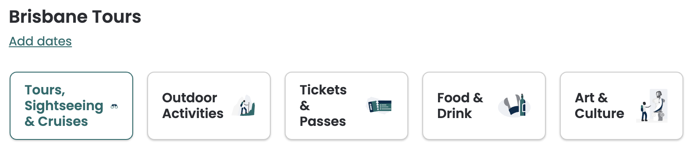

# Resolving references

Some information in the product content response is not communicated explicity; but rather, by reference, and therefore requires an extra de-referencing step to acquire the full details of the element.

These data types comprise:

- locations
- destinations
- tags

The following sections describe how to de-reference these elements using the API.

## Location references

All locations within the product content response are given as a location reference; e.g.:

```javascript
 "activityInfo": {
    "location": {
        "ref": "LOC-o0AXGEKPN4wJ9sIG0RAn5Cdd0Y9TkTxkcosDq0rJgjR12IzpogNi5POX+yGLXEoq"
    },
```

These location references can be resolved using the [/locations/bulk](../../../openapi/reference/operation/locationsBulk) endpoint; for example:

**Request**:

```javascript
{
  "locations": [
    "LOC-o0AXGEKPN4wJ9sIG0RAn5Cdd0Y9TkTxkcosDq0rJgjR12IzpogNi5POX+yGLXEoq",
    "LOC-6eKJ+or5y8o99Qw0C8xWyK8Z2imHSU8Ozi+NYupJVyI="
  ]
}
```

**Response**:

```javascript
{
  "locations": [
    {
      "provider": "GOOGLE",
      "reference": "LOC-o0AXGEKPN4wJ9sIG0RAn5Cdd0Y9TkTxkcosDq0rJgjR12IzpogNi5POX+yGLXEoq",
      "providerReference": "ChIJS1UFbTyX1ZER0vTgCLKWCEQ"
    },
    {
      "provider": "TRIPADVISOR",
      "reference": "LOC-6eKJ+or5y8o99Qw0C8xWyK8Z2imHSU8Ozi+NYupJVyI=",
      "name": "Valley of the Roses",
      "address": {
        "street": "Dades Valley, near Bouteghrar",
        "administrativeArea": "El Kelaa M'gouna",
        "country": "Morocco",
        "countryCode": "MA",
        "postcode": "43000"
      },
      "center": {
        "latitude": 34.00061,
        "longitude": -6.84494
      }
    }
  ]
}
```

Note that there are two different location information providers, `"TRIPADVISOR"` and `"GOOGLE"`, referring to locations in the Tripadvisor location database or locations provided by the [Google Maps platform](https://cloud.google.com/maps-platform/) via the [Google Places API](https://developers.google.com/maps/documentation/places/web-service/overview), respectively. 

Tripadvisor locations include full details of the location in the response from [/locations/bulk](../../../openapi/reference/operation/locationsBulk), including address and geolocation information. However, you will need to use the [Google Places API](https://developers.google.com/maps/documentation/places/web-service/overview) to retrieve details for Google Maps locations.

The purpose of referring to locations by reference is to avoid the unnecessary transmission of duplicate data, as multiple products may include the same location reference. Therefore, we recommend caching the data received from this endpoint, checking this first to see if a particular location's details have been retrieved by your system in the past before making a request to [/locations/bulk](../../../openapi/reference/operation/locationsBulk).

Requests can be made to [/locations/bulk](../../../openapi/reference/operation/locationsBulk) asynchronously; e.g., during the content ingestion process.


## Destination references

Every product in the Viator catalogue is categorized according to the destination/locale in which it operates. There are three kinds of destination:

| Destination type | Meaning |
|------------------|---------|
| “COUNTRY” | A country; e.g., “Australia”, “Japan”, “USA” |
| "REGION" | A geographical region or state; e.g., “South Australia”, “French Riviera”, “Punjab” |
| "CITY" | A city within a state; e.g., “Townsville”, “Osaka”, “Singapore” |

Products are categorized according to their 'destination', which includes cities, regions and countries. 

**Example destinations**:

| `destinationName` | `destId` | `destinationType` |
|-----------------|--------|-----------------|
| USA | 77 | COUNTRY |
| Wisconsin | 22231 | REGION |
| Madison | 24146 | CITY |
| France | 51 | COUNTRY |
| Brittany | 21942 | REGION |
| Rennes | 21943 | CITY |

Every product has one or more destinations associated with it by way of its destination reference. This is given in the `destinations` object in the response from any of the product content endpoints; e.g.:

```javascript
"destinations": [
  {
    "ref": "34198",
    "primary": true
  }
],
```

To de-reference destination identifiers, you must use our destination taxonomy, which can be retrieved from the [/v1/taxonomy/destinations](../../../openapi/reference/operation/v1TaxonomyDestinations) endpoint.

You may wish to filter products according to destination.

A call to [/v1/taxonomy/destinations](../../../openapi/reference/operation/v1TaxonomyDestinations) will return data for **all** available destinations. We recommend you store a local copy of this mapping information, as destination data does not change frequently – i.e., new destinations are rarely added. It is only necessary to re-ingest the destination mapping data in the event you encounter a product associated to a destination reference for which you do not have the details.

**Example snippet of destination taxa**:

```javascript
{
  "sortOrder": 24,
  "selectable": true,
  "destinationUrlName": "Seminyak",
  "defaultCurrencyCode": "USD",
  "lookupId": "2.15.98.34198",
  "parentId": 98,
  "timeZone": "Asia/Makassar",
  "iataCode": "",
  "destinationId": 34198,
  "destinationType": "CITY",
  "latitude": -8.68877,
  "longitude": 115.161267,
  "destinationName": "Seminyak"
},
{
  "sortOrder": 2,
  "selectable": true,
  "destinationUrlName": "Buenos-Aires",
  "defaultCurrencyCode": "USD",
  "lookupId": "9.78.22280.901",
  "parentId": 22280,
  "timeZone": "America/Argentina/Buenos_Aires",
  "iataCode": "BUE",
  "destinationId": 901,
  "destinationType": "CITY",
  "latitude": -34.6084175,
  "longitude": -58.3731613,
  "destinationName": "Buenos Aires"
},
...
```

Note that destinations are organized into a hierarchy. The destination's position in the hierarchy can be determined according to the `parentId` and `lookupId` fields.

In the second example above, Buenos-Aires is a `"CITY"`, and it has a `parentId` of `22280`, which is the `destinationId` of "The Pampas" – the `"REGION"` in South America where Buenos-Aires is located.

The destination's full lineage with respect to the hierarchy is given in `lookupId`, which is a series of destination ids separated by periods - in this case:

```javascript
  "lookupId": "9.78.22280.901"
```

| Component | Destination name | Destination type |
|-----------|------------------|------------------|
| 9 | (unnamed) | (broad continental designation) | 
| 78 | Argentina | "COUNTRY" |
| 22280 | The Pampas | "REGION" |
| 901 | Buenos-Aires | "CITY" |

Using this information, you are able to categorize each product into its geographical location for display and search purposes.

## Tag references

Each product is also categorized according to its content, features or theme. Each attribute has a corresponding identifier called a 'tag'. The tag references for each product are contained in the `tags` array, in the response from any of the product content endpoints.

**Example tags array** (product [250380P1 – Surf lessons Bali, Canggu](https://www.viator.com/tours/Seminyak/Surf-lessons-Bali-Canggu/d34198-250380P1)): 

```javascript

"tags": [
  20246,
  21946,
  20244
],
```

These numeric tag identifiers can be de-referenced using information available from the [/products/tags](../../../openapi/reference/operation/productsTags) endpoint. This service takes no parameters and retrieves information for **all** available tags. 

We recommend you store a local copy of this information, as tags do not change frequently. It is only necessary to re-ingest from this endpoint in the event you encounter a product that references a tag for which you do not have the details.

As with destinations, tags are organized into a hierarchy. A tag's relative position within that hierarchy can be determined by tracing back through its parent tag ids, which (if the tag has any) are listed in its `parentTagIds` element. Each tag can have multiple parent tags, and each tag can eventually be traced back to its parent. Parent tags are tags that have no parents; i.e., they are at the top of the hierachy.

For example, tag: **20244 (Sports Lessons)** in [/products/tags](../../../openapi/reference/operation/productsTags) response:

```javascript
{
  "tagId": 20244,
  "parentTagIds": [
      21478,
      21909,
      21915
  ],
  "allNamesByLocale": {
      "de": "Sportkurse",
      "no": "Treningskurs",
      "sv": "Idrottslektioner",
      "pt": "Aulas de esportes",
      "en_AU": "Sports Lessons",
      "en": "Sports Lessons",
      "it": "Lezioni di sport",
      "fr": "Cours de sport",
      "en_UK": "Sports Lessons",
      "es": "Sesiones deportivas",
      "zh": "运动课",
      "zh_HK": "體育課程",
      "zh_TW": "運動課程",
      "ja": "スポーツ教室",
      "zh_CN": "运动课",
      "da": "Sportsundervisning",
      "nl": "Sportlessen"
  }
},

```

The `parentTagIds` for 20244 - Sports lessons are:

- **21478** – "Active & Outdoor Classes"
- **21909** – "Outdoor Activities"
- **21915** – "Classes & Workshops"

These three tags have no parent tags, and are therefore at the top of the hierarchy. Applying this same process to the other tags in the `tags` array, we can determine the full set of tags for this product, in this case:

- **21909** – "Outdoor Activities"
  - **21478** – "Active & Outdoor Classes"
    - **20244** - "Sports lessons"
- **21915** – "Classes & Workshops" 
- **21946** – "Good for avoiding crowds"
- **21442** – "On the water"
  - **20246** – "Surfing lessons"

By traversing the hierarchy in this way, we have surfaced seven tags that pertain to this product with different levels of generality; i.e. it is an 'active and outdoor class', and it is a 'sports lesson'. More generally, it is an 'outdoor activity', a class or workshop, and is 'good for avoiding crowds':

In this way, you can categorize products for search and recommendation purposes, or to create category display and search buttons as seen on [viator.com 'things to do' pages](https://www.viator.com/Adelaide/d363-ttd); e.g.:

